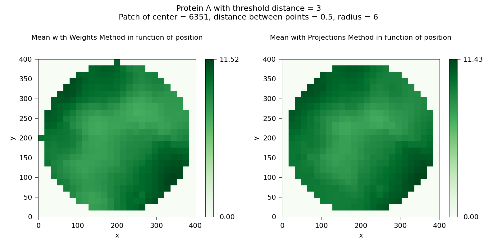
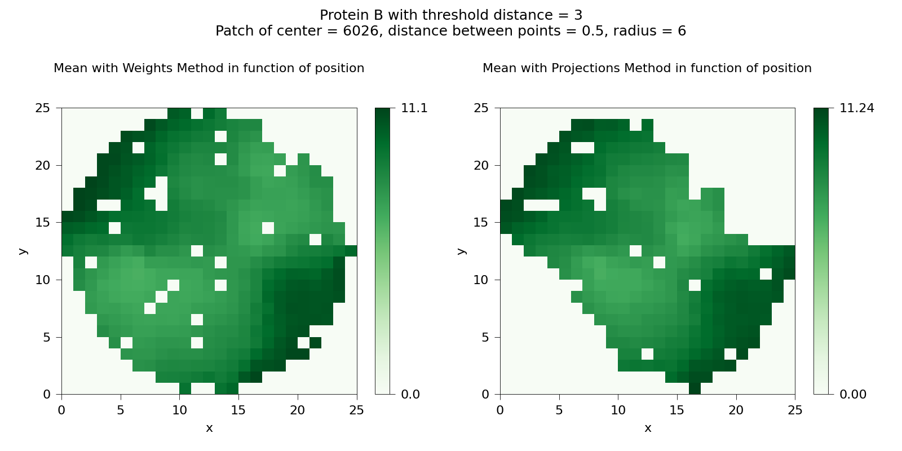

**Autore**: Alessandro Giudice    
**Collaboratore**: Samuel Santhosh Gomez  

# Complementarità nella regione di legame di un complesso proteico
Di seguito riporto la procedura per trovare la zona di contatto in un complesso di due proteine e stimare la loro similarità.  
Il `testo` scritto in questa maniera rappresenta le variabili del codice usato, visibile in appendice.  
I metodi per selezionare una patch, calcolare media e varianza per ogni pixel in disco unitario con due metodi, e produrre i rispettivi grafici sono riportati
<a href="https://github.com/agds93/percentage_non_functionality/" target="_blank">qui</a>
.  

## Ricerca della regione di legame
L'intera superficie del complesso proteico studiato è visibile in Figura 0.
<p align="center"></p>
<p align="center"></p>
<p align="center"><i>Figura 0</i>: Proteina A (blu) e proteina B (rosso) da due punti di vista.</p>

Per trovare la zona di contatto tra le due superfici si utilizza la funzione `GroupNearPoints` in base alla distanza di soglia `Daa` scelta. In particolare la funzione restituisce due zone di contatto:
* `patch_prot_a`, cioè la zona di contatto sulla superficie A (punti blu in Figura 0).
* `patch_prot_b`, cioè la zona di contatto sulla superficie B (punti rossi in Figura 0).

Tale funzione fornisce anche gli indici `center_a` e `center_b` più vicini al centro di massa della zona di contatto, rispettivamente sulla superficie A e sulla superficie B.  
I grafici in Figura 1 rappresentano la media della patch con centro `center_a` ottenuta con due metodi, dove, nei grafici in alto, è presente la media originale. Nella stessa figura, ma nei grafici in basso, è presente la media processata della patch, in cui i pixels vengono incrementati e riempiti per rimuovere le aree vuote presenti nella media originale.

<p align="center"></p>
<p align="center"></p>
<p align="center"><i>Figura 1</i>: Media originale (in alto) e processata (in basso) di una patch della superficie A.</p>

Le stesse cose sono rappresentate nella Figura 2 ma riferite alla patch con centro `center_b`.

<p align="center"></p>
<p align="center"></p>
<p align="center"><i>Figura 2</i>: Media originale (in alto) e processata (in basso) di una patch della superficie B.</p>

## Complementarietà  
Date due patch dentro la zona di contatto (la prima nella superficie A e la seconda nella superficie B), per sapere quanto sono complementari bisogna calcolare, tramite `ZernikeCoeff_Distance`, la differenza `c_inv_diff` dei moduli dei coefficienti dell'espansione di Zernike tra i rispettivi piani processati delle due patch. Tali piani processati sono i grafici nella parte bassa della Figura 1-2.  
Le patch da cui si ricavano i grafici in Figura 1 e Figura 2 hanno come centro rispettivamente `center_a` e `center_b`, cioè il punto più vicino al centro di massa di tale zona. Di conseguenza tali patch hanno la maggiore similarità tra tutte le possibili altre nella zona di contatto, quindi il valore di `c_inv_diff` tra le due rispettive liste di coefficienti di Zernike è circa pari a uno.

## Appendice
### Librerie e moduli
Il codice scritto è stato eseguito con <a href="https://jupyterlab.readthedocs.io/en/stable/" target="_blank">JupyterLab</a> utilizzando `python 3.8`.  
I moduli python usati, compreso `jupyterlab`, installati tramite 
<a href="https://pip.pypa.io/en/stable/" target="_blank">pip</a>, sono elencati sotto.
```python
import os, sys
import numpy as np
import matplotlib.pyplot as mpl
import scipy as sp
import pandas as pd
```
```python
from mayavi import mlab
```
Il modulo `mayavi`, in particolare `mlab`, è necessario per visualizzare le superfici 3D in una finestra Qt.  
Mentre le librerie di base sono
```python
sys.path.append("./bin/")
import ZernikeFunc as ZF
import SurfaceFunc as SF
```
scritte da <a href="https://scholar.google.it/citations?user=hjkTN0YAAAAJ&hl=it" target="_blank">Mattia Miotto</a>.
### Parametri
I valori dei parametri usati per selezionare una patch e produrre il piano di fit sono
```python
Npixel = 25    # il lato del piano in pixel
Dpp = 0.5      # la distanza tra i punti della stessa patch
Rs = 6         # il raggio della sfera che include la patch
threshold = 5  # valore soglia per stabilire se la varianza è alta
ZOrder = 20    # ordine dell'espansione di Zernike
Daa = 3        # distanza di soglia per trovare punti di contatto tra le superfici
```
I valori sono in ångström, tranne `Npixel` e `ZOrder`.
### Caricare le superfici
Per caricare i punti della superficie della proteina A (disponibile 
<a href="data/3B0F_A_min.dms" target="_blank">qui</a>
) ed inizializzare l'oggetto di classe `Surface` si usa
```python
surf_name_a = "./data/3B0F_A_min.dms"
surf_a_ = pd.read_csv(surf_name_a)
l_a = len(surf_a_["x"])
print("Npoints Protein A =", l_a)
surf_a = np.zeros((l_a, 6))
surf_a[:,:] = surf_a_[["x", "y", "z", "Nx", "Ny", "Nz"]]
surf_a_obj = SF.Surface(surf_a[:,:], patch_num = 0, r0 = Rs, theta_max = 45)
```
Per caricare i punti della superficie della proteina B (disponibile 
<a href="data/3B0F_B_min.dms" target="_blank">qui</a>
) ed inizializzare l'oggetto di classe `Surface` si usa
```python
surf_name_b = "./data/3B0F_B_min.dms"
surf_b_ = pd.read_csv(surf_name_b) 
l_b = len(surf_b_["x"])
print("Npoints Protein B =", l_b)
surf_b = np.zeros((l_b, 6))
surf_b[:,:] = surf_b_[["x", "y", "z", "Nx", "Ny", "Nz"]]
surf_b_obj = SF.Surface(surf_b[:,:], patch_num = 0, r0 = Rs, theta_max = 45)
```
### Utilità
Dato un insieme di punti `points` e un altro punto `P`, la seguente funzione restituisce l'elemento di `points` più vicino a `P`.
```python
def PointNearPoint(points, P) :
    dist_points_P = np.sqrt( (points[:,0]-P[0])**2 + (points[:,1]-P[1])**2 + (points[:,2]-P[2])**2 )
    min_dist = np.amin(dist_points_P)
    point_near_P = int( np.where(dist_points_P == min_dist)[0] )
    return point_near_P
```
Questa funzione sarà usata in `GroupNearPoints` per trovare il punto più vicino al centro di massa.  
### Ricerca zona di contatto
Dati due oggetti superficie (`surf_a_obj` e `surf_b_obj`) e una distanza di soglia `Daa`, la seguente funzione restituisce:  
* l'indice del punto della superficie A più vicino al centro di massa della propria regione di contatto.
* la matrice dei punti della zona di contatto sulla superficie A.
* l'indice del punto della superficie B più vicino al centro di massa della propria regione di contatto.
* la matrice dei punti della zona di contatto sulla superficie B.
```python
def GroupNearPoints(Daa, surf_a_obj, surf_b_obj) :
    prot_A = surf_a_obj.surface[:,:3]
    prot_B = surf_b_obj.surface[:,:3]
    print("Research of contact points. This step requires time...")
    patch_prot_a, patch_prot_b = SF.ContactPoints(prot_A, prot_B, Daa)
    print("Research complete.")
    cm_a = np.mean(patch_prot_a[:,:3], axis=0)
    print("CM of protein A group =", cm_a)
    center_a = PointNearPoint(patch_prot_a[:,:3], cm_a)
    print("Patch protein A: Center = {} with coord = {}".format(center_a, patch_prot_a[center_a,:3]))
    cm_b = np.mean(patch_prot_b[:,:3], axis=0)
    print("CM of protein B group =", cm_b)
    center_b = PointNearPoint(patch_prot_b[:,:3], cm_b)
    print("Patch protein B: Center = {} with coord = {}".format(center_b, patch_prot_b[center_b,:3]))
    return center_a, patch_prot_a[:,:3], center_b, patch_prot_b[:,:3]
```
Tale funzione viene utilizzata con
```python
center_a, patch_prot_a, center_b, patch_prot_b = GroupNearPoints(Daa, surf_a_obj, surf_b_obj)
```
Però gli indici dei punti `center_a` e `center_b` dalla funzione `GroupNearPoints` sono riferiti alle zone di contatto `patch_prot_a` e `patch_prot_b`. Per ottenere gli indici rispetto alle superfici intere si utilizza
```python
center_a_true = PointNearPoint(surf_a[:,:3], patch_prot_a[center_a])
center_b_true = PointNearPoint(surf_b[:,:3], patch_prot_b[center_b])
center_a = center_a_true
center_b = center_b_true
```
### Creazione delle patch
La seguente funzione genera le medie di due patch (una per superficie) con orientazioni opposte per ogni metodo.
```python
def PatchesMethods(Npixel, surf_a_obj, c_a, surf_b_obj, c_b, Dpp) :
    patch_a, _ = surf_a_obj.BuildPatch(point_pos=c_a, Dmin=Dpp)
    rot_patch_a, rot_patch_nv_a = surf_a_obj.PatchReorientNew(patch_a, +1)
    z_pa = surf_a_obj.FindOrigin(rot_patch_a)
    plane_W_a, _, _, _ = CreatePlane_Weigths("mean", patch=rot_patch_a, z_c=z_pa, Np=Npixel)
    plane_P_a, _, _, _ = CreatePlane_Projections("mean", patch=rot_patch_a, z_c=z_pa, Np=Npixel)
    patch_b, _ = surf_b_obj.BuildPatch(point_pos=c_b, Dmin=Dpp)
    rot_patch_b, rot_patch_nv_b = surf_b_obj.PatchReorientNew(patch_b, -1)
    z_pb = surf_b_obj.FindOrigin(rot_patch_b)
    plane_W_b, _, _, _ = CreatePlane_Weigths("mean", patch=rot_patch_b, z_c=z_pb, Np=Npixel)
    plane_P_b, _, _, _ = CreatePlane_Projections("mean", patch=rot_patch_b, z_c=z_pb, Np=Npixel)
    return plane_W_a, plane_P_a, plane_W_b, plane_P_b
```
### Coefficienti di Zernike
La seguente funzione restituisce il piano processato `plane_proc`, la lista dei coefficienti di Zernike `coeff` e i loro moduli `coeff_inv`.
```python
def ZernikeCoeff(ZOrder, surf_a_obj, plane) :
    plane_proc = surf_a_obj.EnlargePixels( surf_a_obj.FillTheGap_everywhere(plane_=plane) )
    zernike_env = ZF.Zernike2d(plane_proc)
    coeff = zernike_env.ZernikeDecomposition(order=ZOrder)  # coeff is a list
    coeff_inv = np.absolute(coeff)
    return plane_proc, coeff, coeff_inv
```
La seguente funzione che calcola la differenza `c_inv_diff` tra due liste di moduli di coefficienti di Zernike.
```python
def ZernikeCoeff_Distance(ZOrder, surf_a_obj, plane_1, surf_b_obj, plane_2) :
    _, _, c_inv_1 = ZernikeCoeff(ZOrder, surf_a_obj, plane_1)
    _, _, c_inv_2 = ZernikeCoeff(ZOrder, surf_b_obj, plane_2)
    c_inv_diff = np.sqrt( sum( (c_inv_1[:]-c_inv_2[:])**2 ) )
    return c_inv_diff
```
### Grafici
La seguente funzione grafica la media di una patch prodotta con due diversi metodi: `CreatePlane_Weigths` e `CreatePlane_Projections`. Tale funzione produce i grafici in Figura 1-2. Gli input sono:
* il nome della proteina da inserire nel titolo.
* il numero di pixel `Npixel`. 
* il raggio `Rs` della sfera che include la patch.
* il piano generato da `CreatePlane_Weigths`.
* il piano generato da `CreatePlane_Projections`.
* l'indice `center` scelto come centro della patch.
* la distanza tra i punti della patch `Dpp`.
* il valore `Daa` della distanza di soglia.
* le mappe dei <a href="https://matplotlib.org/stable/tutorials/colors/colormaps.html" target="_blank">colori</a> da utilizzare.
* il nome del file di output.
```python
def PlotPatchesComparison(obj_name, Npixel, Rs, p_W, p_P, center, Dpp, Daa, color_map, name) :
    if obj_name == "" :
        obj_name = "Unknown"
    if len(color_map) != 1 :
        color_map = "Greens"
    matrix = [ p_W, p_P ]
    s0 = "Protein = {}, Daa = {}\nPatch of center = {}, distance between points = {}, radius = {}".format(obj_name, Daa, center, Dpp, Rs)
    s1 = "Mean with Weigths Method in function of position\n\n"
    s2 = "Mean with Projections Method in function of position\n\n"
    titles = [ s1, s2 ]
    fig, ax = mpl.subplots(nrows=1, ncols=2, figsize=(8,4), dpi=200, facecolor="white")
    fig.suptitle(s0, fontsize="9")
    for row in range(1) :
        for col in range(2):
            data = matrix[col]
            ax[col].set_title(titles[col], fontsize="8")
            ax[col].set_xlabel("x", fontsize="8")
            ax[col].set_ylabel("y", fontsize="8")
            ax[col].tick_params(axis="both", width ="0.30", color="black", labelsize="8")
            for side in ax[col].spines.keys():  # 'top', 'bottom', 'left', 'right'
                ax[col].spines[side].set_linewidth(0.30)
                ax[col].spines[side].set_color("black")
            im = ax[col].pcolormesh(data, cmap=color_map, rasterized=True)
            ticks_list = [np.amin(data), np.amax(data)]
            cb = mpl.colorbar(im, ax=ax[col], ticks=ticks_list)
            cb.ax.tick_params(axis="both", width ="0.30", color="black", labelsize="8")
            for side in cb.ax.spines.keys():  # 'top', 'bottom', 'left', 'right'
                cb.ax.spines[side].set_linewidth(0.30)
                cb.ax.spines[side].set_color("black")
    fig.tight_layout()
    if name != "" or name == "default" :
        if name == "default" :
            n = "Mean_Patch{}_Dpp{}".format(center, Dpp)
        else :
            n = name
        mpl.savefig("{}.pdf".format(n))
        print("The figure was generated.")
```
